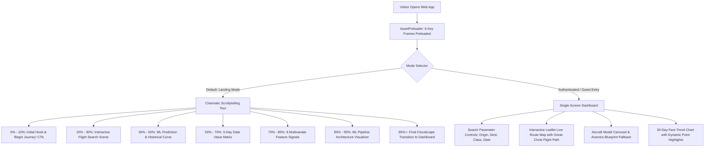
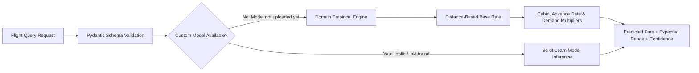

# Skyline सारथी — System Architecture

This document describes the architectural design, directory organization, data flows, and inference pipelines of the Skyline सारथी platform.

---

## 1. Directory Structure

```
Skyline_sarathi/
├── frontend/                     # React 18 + Vite + Tailwind Client
│   ├── src/
│   │   ├── components/           # UI Components (HeroScrollytelling, Dashboard, GoogleRouteMap, etc.)
│   │   ├── services/             # API client services (api.js)
│   │   ├── styles/               # Global styles (index.css)
│   │   ├── App.jsx               # Top-level view mode orchestrator (Tour vs Dashboard)
│   │   └── main.jsx              # DOM root mount
│   ├── public/                   # Static assets (optimized frames, aircraft images, clouds)
│   ├── index.html                # Single-page HTML entry point
│   ├── vite.config.js            # Vite config with HMR & reverse proxy to backend
│   └── package.json              # Frontend dependencies and npm scripts
│
├── backend/                      # Python FastAPI + Machine Learning Backend
│   ├── app/
│   │   ├── api/                  # REST API routes (/api/predict, /api/analytics, /api/health)
│   │   ├── config/               # Settings & environment variables (settings.py)
│   │   ├── ml/                   # Model loader, preprocessing & feature engineering
│   │   ├── models/               # Pydantic schemas & ML candidate weights
│   │   ├── services/             # Business logic & fare estimation
│   │   └── main.py               # FastAPI application entry & CORS middleware
│   ├── requirements.txt          # Python dependencies
│   ├── run.py                    # Startup script for Uvicorn server (port 8000)
│   └── test_backend.py           # Verification and sanity test suite
│
├── resources/                    # Raw media, video source files & frame extracts
│   ├── Airplane_floats_in_studio_1080p_20260914185818-ezremove.mp4
│   ├── ezgif-8bff5c46bd0c48dd-jpg/
│   └── test_blended.jpg
│
├── docs/                         # Technical documentation & knowledge base
│   ├── ARCHITECTURE.md           # System architecture & data flow
│   └── TECH_STACK.md             # Complete technology stack reference
│
├── README.md                     # Root project guide & startup instructions
└── package.json                  # Root convenience scripts for workspace management
```

---

## 2. User Experience Flow: Dual-Mode Architecture

The application provides two complementary user experiences coordinated by [App.jsx](file:///d:/UNI/SIH/Galctica/frontend/src/App.jsx):



---

## 3. Hybrid Machine Learning Pipeline

The backend implements a fault-tolerant hybrid inference design:



1. **Auto-Detection**: `ModelLoader` scans for `.joblib`, `.pkl`, or `.onnx` files in `backend/app/models/`.
2. **Graceful Fallback**: If no trained weights are uploaded, the empirical calculation estimates realistic airfares based on geodesic distance, cabin multipliers, advance booking windows, and seasonal demand factors.
3. **Zero Downtime**: The frontend functions reliably whether a custom dataset has been trained or not.
